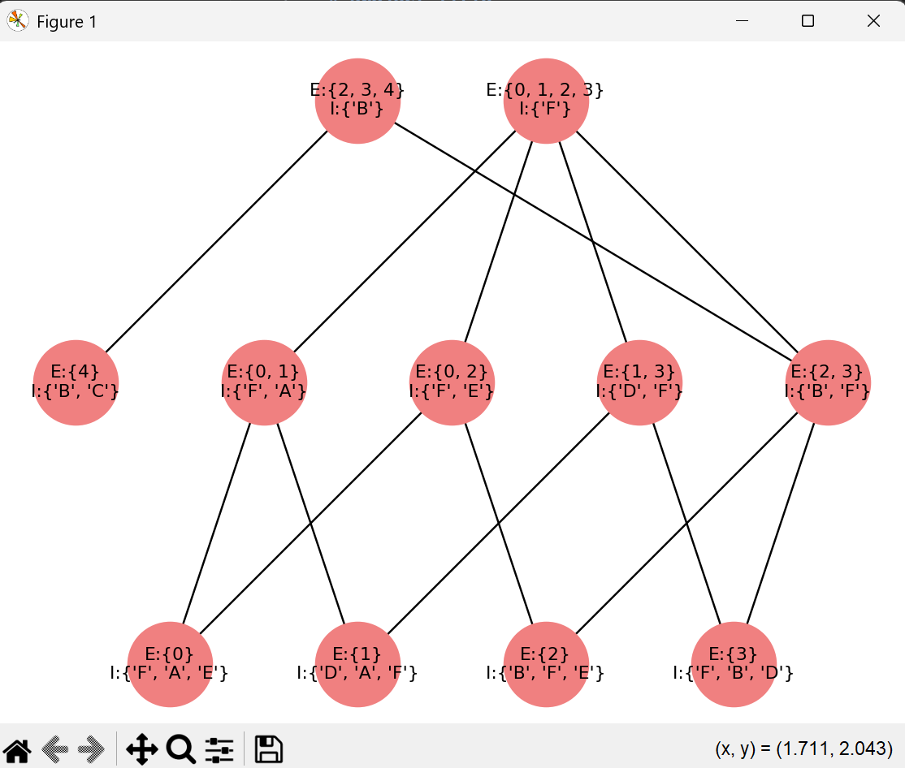

# Concept Lattice for a Formal Concept Analysis(FCA)
---

## 📘 Description

In Formal Concept Analysis concept lattice is used as a better way of representing 
a data in a graphical way, and it has a lot of applcations in machine learing, Data Mining, and others.

- What this code does is that it takes a context or a data set in format like the one below in csv file, 
and returns a graph that represents the dataset in a more compact and readble form.


---

## 🧾 Example

- Context (Dataset)


- Concept lattice


---

## 📦 Requirements

Install dependencies:

```bash
pip install networkx matplotlib
